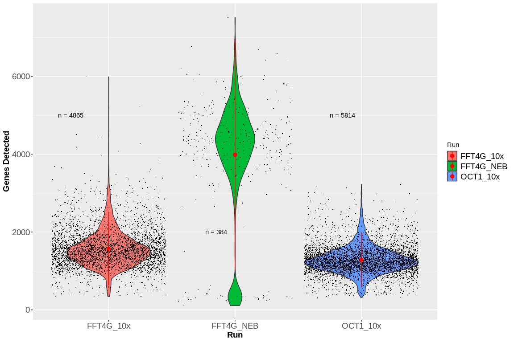
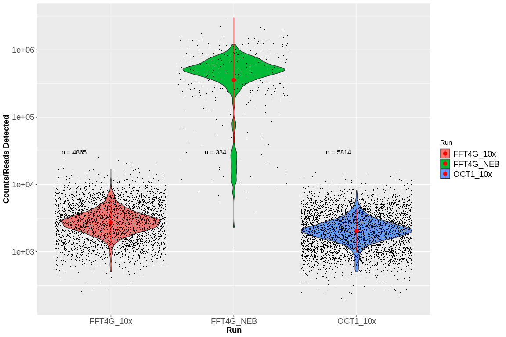

Single Nucleus Sequencing Trial Quality Control and Analysis
================

To reproduce this analysis on CellGenes JupyterHub first copy paste the
following commands into the terminal to get data from our /nfs storage
on the farm:

cd mkdir data/snQCandAnalysis/  
mkdir data/snQCandAnalysis/OCT1\_10x/  
mkdir data/snQCandAnalysis/FFT4G\_10x/  
mkdir data/snQCandAnalysis/FFT4G\_NEB/

Then replace aa16 in the following commands with your own sangerID and
type in your farm3 password, when asked to do so, to access the
sequencing data:  
rsync -avzhr
<aa16@farm3-login>:/nfs/team283/sequencing/snSeq/cellranger302\_count\_29507\_5705STDY7945423\_mm10-3\_0\_0\_premrna/filtered\_feature\_bc\_matrix
data/snQCandAnalysis/FFT4G\_10x/  
gunzip
data/snQCandAnalysis/FFT4G\_10x/filtered\_feature\_bc\_matrix/features.tsv.gz

rsync -avzhr
<aa16@farm3-login>:/nfs/team283/sequencing/snSeq/cellranger302\_count\_29507\_5705STDY7945424\_mm10-3\_0\_0\_premrna/filtered\_feature\_bc\_matrix
data/snQCandAnalysis/OCT1\_10x/  
gunzip
data/snQCandAnalysis/OCT1\_10x/filtered\_feature\_bc\_matrix/features.tsv.gz

rsync -avzhr
<aa16@farm3-login>:/nfs/team283/sequencing/snSeq/tic-281/combined\_premrna/premrna-study5705-tic281-star-genecounts.txt
data/snQCandAnalysis/FFT4G\_NEB/

Now we load we load the three datasets into R, as well as the required R
packages:

``` r
require(Matrix)
library(Seurat)
require(myUtils)
require(ggplot2)
require(Hmisc)
library(SoupX)
require(biomaRt)

# Neb data:
data_NEB = read.delim('/home/jovyan/data/snQCandAnalysis/FFT4G_NEB/premrna-study5705-tic281-star-genecounts.txt', header = TRUE, row.names = 1)

# 10x data:
data_10xF = readMM('/home/jovyan/data/snQCandAnalysis/FFT4G_10x/filtered_feature_bc_matrix/matrix.mtx.gz')
rowdata_10xF = read.delim('/home/jovyan/data/snQCandAnalysis/FFT4G_10x/filtered_feature_bc_matrix/features.tsv', header = FALSE)
coldata_10xF = read.delim('/home/jovyan/data/snQCandAnalysis/FFT4G_10x/filtered_feature_bc_matrix/barcodes.tsv.gz', header = FALSE)
data_10xF = as.matrix(data_10xF)
rownames(data_10xF) = rowdata_10xF[,2]
colnames(data_10xF) = coldata_10xF[,1]

data_10xO = readMM('/home/jovyan/data/snQCandAnalysis/OCT1_10x/filtered_feature_bc_matrix/matrix.mtx.gz')
rowdata_10xO = read.delim('/home/jovyan/data/snQCandAnalysis/OCT1_10x/filtered_feature_bc_matrix/features.tsv', header = FALSE)
coldata_10xO = read.delim('/home/jovyan/data/snQCandAnalysis/OCT1_10x/filtered_feature_bc_matrix/barcodes.tsv.gz', header = FALSE)
data_10xO = as.matrix(data_10xO)
rownames(data_10xO) = rowdata_10xO[,2]
colnames(data_10xO) = coldata_10xO[,1]
colnames(data_10xO) = paste(colnames(data_10xO),'2', sep = '')
```

The first QC step I made is to look at the fraction of counts/reads from
mitochondrial genes and potentially remove any outliers:

``` r
# NEB
# Mitochondrial Genes:
# ensembl = useMart("ensembl")
# ensembl = useDataset("mmusculus_gene_ensembl",mart=ensembl)
# mtGenes = getBM(attributes = 'mgi_symbol', filter = 'chromosome_name', values = "MT", mart = ensembl)
# mtGenes = as.character(unlist(mtGenes))[as.character(unlist(mtGenes)) %in% rownames(data_10xF)]
mtGenes_symbol = c("mt-Nd1", "mt-Nd2", "mt-Co1", "mt-Co2", "mt-Atp8", "mt-Atp6", "mt-Co3",
                   "mt-Nd3", "mt-Nd4l", "mt-Nd4", "mt-Nd5", "mt-Nd6", "mt-Cytb")
mtGenes_eg = c('ENSMUSG00000064341', 'ENSMUSG00000064345', 'ENSMUSG00000064351', 'ENSMUSG00000064354', 'ENSMUSG00000064356',
                   'ENSMUSG00000064357', 'ENSMUSG00000064358', 'ENSMUSG00000064360', 'ENSMUSG00000065947', 'ENSMUSG00000064363',
                   'ENSMUSG00000064367', 'ENSMUSG00000064368', 'ENSMUSG00000064370')
# mtGenes_et =  c('ENSMUST00000082392.1', 'ENSMUST00000082396.1', 'ENSMUST00000082402.1', 'ENSMUST00000082405.1', 'ENSMUST00000082407.1',
#                 'ENSMUST00000082408.1', 'ENSMUST00000082409.1', 'ENSMUST00000082411.1', 'ENSMUST00000084013.1', 'ENSMUST00000082414.1',
#                 'ENSMUST00000082418.1', 'ENSMUST00000082419.1', 'ENSMUST00000082421.1')
mtProp0 = colSums(data_NEB[mtGenes_eg,])/colSums(data_NEB)
mtProp1 = colSums(data_10xF[mtGenes_symbol,])/colSums(data_10xF)
mtProp2 = colSums(data_10xO[mtGenes_symbol,])/colSums(data_10xO)

mtDataFrame = data.frame(mtProp = c(mtProp0, mtProp1, mtProp2),
                         Run = c(rep('FFT4G_NEB', length(mtProp0)), rep('FFT4G_10x', length(mtProp1)), rep('OCT1_10x', length(mtProp2))))

p0 <- ggplot(mtDataFrame, aes(x=Run, y=mtProp, fill = Run)) + 
  scale_y_log10() +
  geom_violin() + 
  geom_jitter(shape=16, size = 0.45, width = 0.45, height = 0.05) +
  stat_summary(fun.y=mean, geom="point", size=2, color="red") +
  ylab('Mitochondrial RNA Counts Proportion') +
  theme(axis.text=element_text(size=14),
        axis.title=element_text(size=14,face="bold"),
        legend.text=element_text(size=14)) +
  annotate("text", x = 0.7, y = 0.00001, label = "n(y = 0) = 3662") +
  annotate("text", x = 1.85, y = 0.00001, label = "n(y = 0) = 160") +
  annotate("text", x = 2.85, y = 0.00001, label = "n(y = 0) = 1284")
p0
```

<!-- -->

``` r
pdf(file = 'figures/mitochondrialPercentage.pdf', width = 10, height = 10)
p0
dev.off()
```

    ## png 
    ##   2

For now I did not remove any cells with high mitochondiral RNA count
from the analysis, but in the future we can also choose to be more
stringent.

Next I considered the number of detected Genes and total counts/reads
per cells (with counts I refer to unique transcript reads in the 10x
technology, while reads from NEB can correspond to the same transcript,
so both are not directly comparable, but still give a rough overview of
the data quality…).

``` r
genesDetected1 = colSums(data_10xF > 0)
genesDetected2 = colSums(data_10xO > 0)
genesDetected3 = colSums(data_NEB > 0)

readsDetected1 = colSums(data_10xF)
readsDetected2 = colSums(data_10xO)
readsDetected3 = colSums(data_NEB)


numberOfCells1 = length(genesDetected1)
numberOfCells2 = length(genesDetected2)
numberOfCells3 = length(genesDetected3)

qcDataFrame = data.frame(genesDetected = c(genesDetected1, genesDetected2, genesDetected3),
                         readsDetected = c(readsDetected1, readsDetected2, readsDetected3),
                         Run = c(rep('FFT4G_10x', length(genesDetected1)), rep('OCT1_10x', length(genesDetected2)), rep('FFT4G_NEB', length(mtProp0))))

p1 <- ggplot(qcDataFrame, aes(x=Run, y=genesDetected, fill = Run)) + 
  geom_violin() + 
geom_jitter(shape=16, size = 0.25, width = 0.45, height = 0.45) +
  stat_summary(fun.data=mean_sdl, mult=1, geom="pointrange", color="red") +
  theme(axis.text=element_text(size=14),
        axis.title=element_text(size=14,face="bold"),
        legend.text=element_text(size=14)) +
  annotate("text", x = 0.7, y = 5000, label = "n = 4865") +
  annotate("text", x = 1.85, y = 2000, label = "n = 384") +
  annotate("text", x = 2.85, y = 5000, label = "n = 5814") + ylab('Genes Detected')
p1
```

<!-- -->

``` r
pdf(file = 'figures/NumberOfDetectedGenes.pdf', width = 10, height = 10)
p1
dev.off()
```

    ## png 
    ##   2

``` r
p2 <- ggplot(qcDataFrame, aes(x=Run, y=readsDetected, fill = Run)) + 
  scale_y_log10() +
  geom_violin() + 
geom_jitter(shape=16, size = 0.25, width = 0.45, height = 0.45) +
  stat_summary(fun.data=mean_sdl, mult=1, geom="pointrange", color="red") +
  theme(axis.text=element_text(size=14),
        axis.title=element_text(size=14,face="bold"),
        legend.text=element_text(size=14)) +
  annotate("text", x = 0.7, y = 30000, label = "n = 4865") +
  annotate("text", x = 1.85, y = 30000, label = "n = 384") +
  annotate("text", x = 2.85, y = 30000, label = "n = 5814") + ylab('Counts/Reads Detected')
p2
```

<!-- -->

``` r
pdf(file = 'figures/NumberOfReadsOrCounts.pdf', width = 10, height = 10)
p2
dev.off()
```

    ## png 
    ##   2

Now it is obvious from both plots that there are still a few low quality
cells in the NEB dataset (the 10x software cellranger already removed
low count cells in the 10x datasets beforehand). So here I note for
later analysis that I will only analyze cells with more than 2000
detected genes:

``` r
keepNEBafterQC = (colSums(data_NEB != 0) >  2000)
```

For doublet removal I ran the scrublet algorithm (see
<https://www.cell.com/cell-systems/pdfExtended/S2405-4712(18)30474-5>)
in python, which can be replicated by running the three scripts in this
repository called: removeDoublets\_FFT4G10x.py,
removeDoublets\_OCT110x.py and removeDoublets\_FFT4GNEB.py . In a first
step the scrublet algorithm simulates doublets by randomly mixing pairs
of cells. Then it assigns both simulated and real cells a position in
low dimensional space. Cells then get a doublet score, by counting the
number of nearest neighbours that are simulated doublets. In this way a
cells gets a doublet score of 0, when no neighbours are doublets and a
doublet score of 1, when all neighbours are doublets. The python scripts
mentioned above, save all the output from the algorithm in the /scrublet
directory, as well as these plots of doublet scores for the real cell
types and the simulated ones, which we can look at now:

``` r
knitr::include_graphics("scrublet/FFT4G_10x_doubletScore_histogram.pdf")
```

<embed src="scrublet/FFT4G_10x_doubletScore_histogram.pdf" width="1000px" height="350px" type="application/pdf" />

``` r
knitr::include_graphics("scrublet/OCT1_10x_doubletScore_histogram.pdf")
```

<embed src="scrublet/OCT1_10x_doubletScore_histogram.pdf" width="1000px" height="350px" type="application/pdf" />

``` r
knitr::include_graphics("scrublet/FFT4G_NEB_doubletScore_histogram.pdf")
```

<embed src="scrublet/FFT4G_NEB_doubletScore_histogram.pdf" width="1000px" height="350px" type="application/pdf" />
